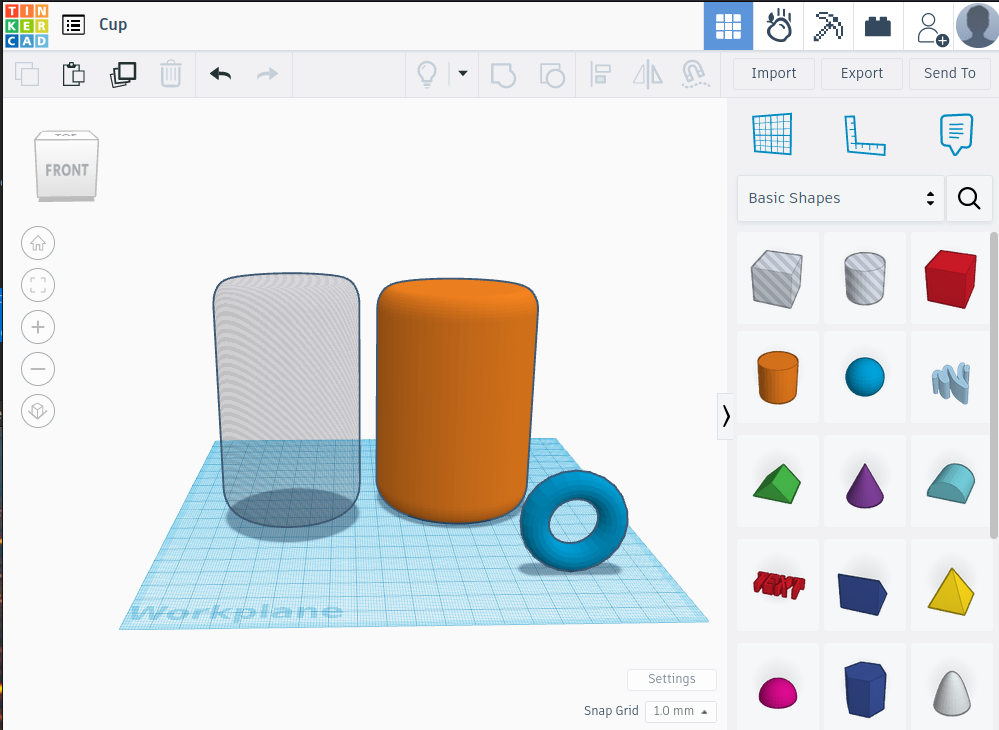
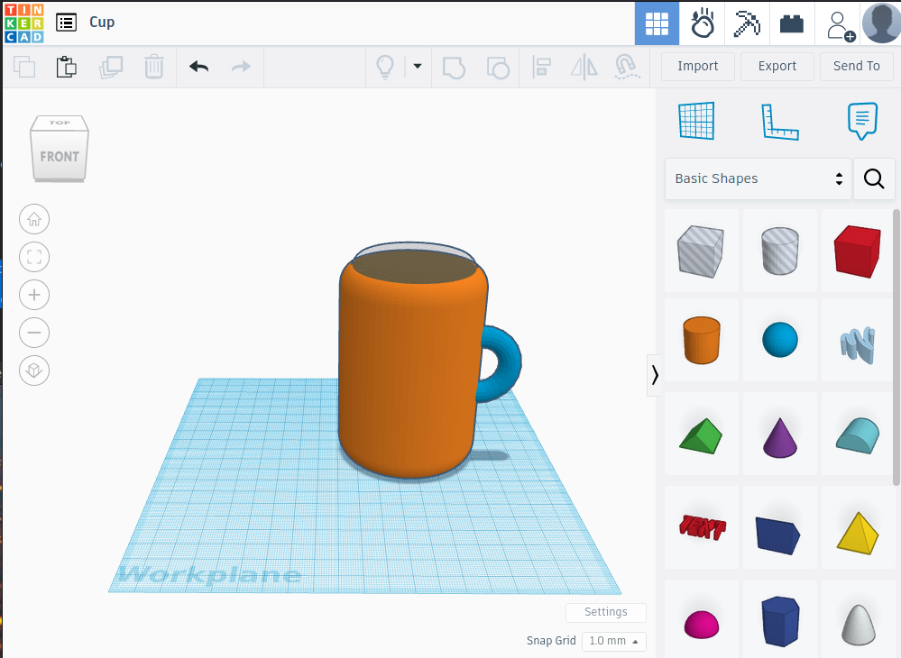
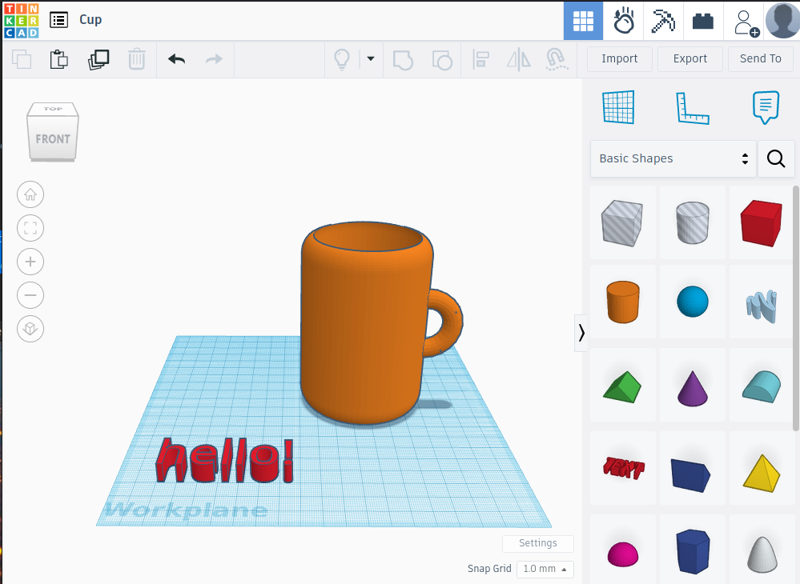
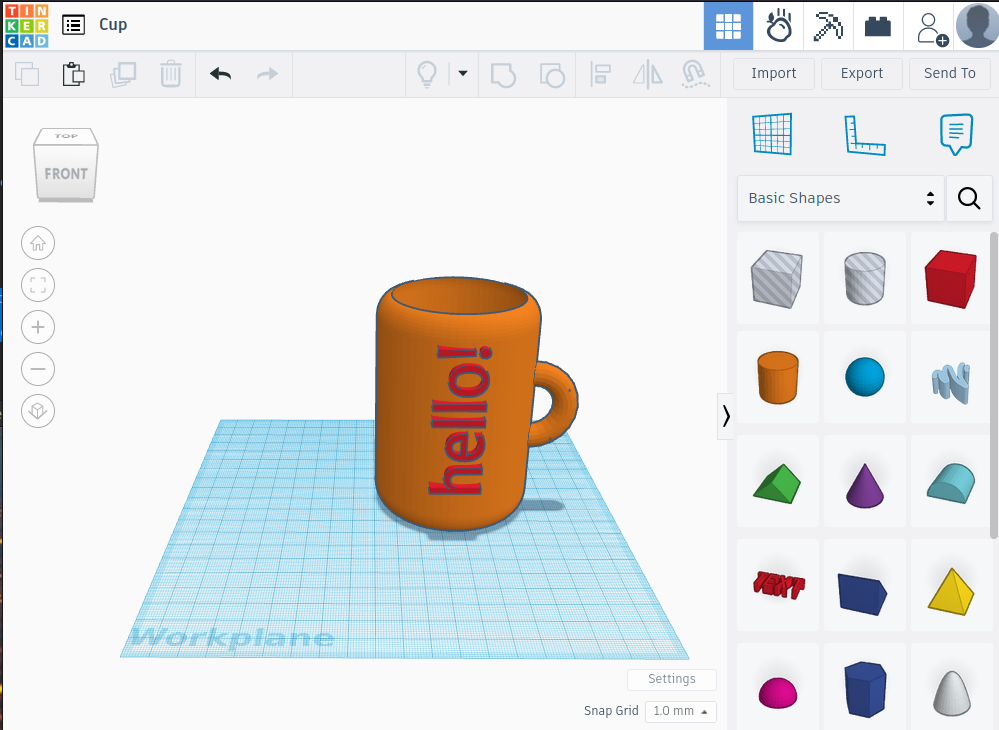
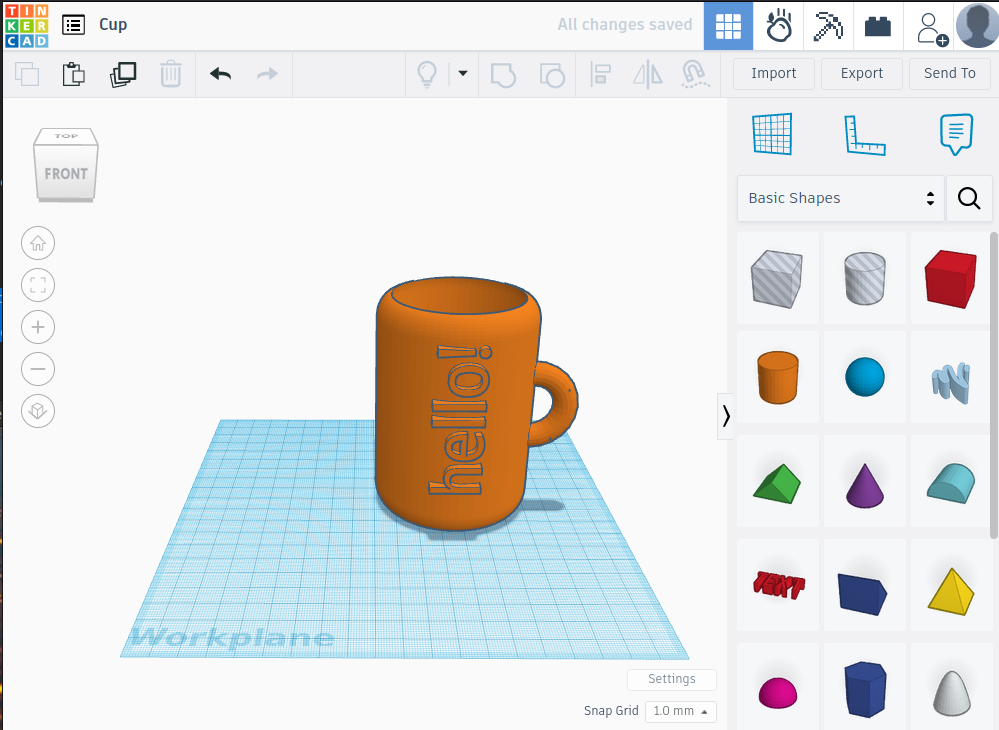

# 3D-cup

Σχεδιάζουμε μια διακοσμητική κούπα που μπορούμε να εκτυπώσουμε. Προσοχή οι 3D εκτυπώσεις δεν είναι κατάλληλες για τρόφιμα.

Η σχεδίαση γίνεται με το λογισμικό Tinkercad, ή άλλο παρόμοιο.

Βήματα:

1) Επιλέγουμε τον κύλινδρο και τον τόρο από τα γεωμετρικά στερεά, στρογγυλεύοντας αν θέλουμε τις γωνίες του κυλίνδου.
2) Διπλασιάζουμε τον κύλινδρο με αντιγραφή - επικόλληση και μετατρέπουμε τον έναν από τους δύο κυλίνδρους σε τρύπα.
3) Μικραίνουμε ελαφρώς το μήκος και το πλάτος της τρύπας αλλά όχι το ύψος και ευθυγραμμίζουμε τους δύο κυλίνδρους τον έναν μέσα στον άλλο.
4) Ευθυγραμμίζουμε τον τόρο στο πλάι της κούπας και ανυψώνουμε στο ύψος που επιθυμούμε.
5) Με το τοροειδές στερεό φτιάχνουμε το χερούλι, ευθυγραμμίζοντάς το στο πλάι της κούπας.
6) Διαχωρίζουμε και ομαδοποιούμε ξανά και τα τρία στερεά. Η κούπα είναι έτοιμη.
7) Με το εργαλείο κειμένου, γράφουμε μια λέξη και ρυθμίζουμε τις διαστάσεις.
8) Περιστρέφουμε και ευθυγραμμίζουμε στο πλάι της κούπας.
9) Ομαδοποιούμε.

      

|         Βήμα 1,2          |        Βήμα 3,4      |
|:----------------------------------:|:------------------------------------:|
|  |  |
|         Βήμα 4          |          Βήμα 4           |
|  |  |
|         Βήμα            |          Slicer           |
|  |  |

Οι διαστάσεις του 3D μοντέλου που βρίσκεται στον φάκελο με τα αρχεία .stl είναι κατάλληλες για ταμπλέτα με ελάχιστες διαστάσεις 220x1x120mm (ΜxΠxΥ) και μέγιστες διαστάσεις 240x13x180mm (MxΠxΥ). Το μοντέλο είναι όμως προσαρμόσιμο μέσω λογισμικού επεξεργασίας 3D μοντέλων (π.χ. tinkercad), αρκεί να ληφθεί μέριμνα να μην αλλοιωθούν οι διαστάσεις του σπειρώματος στήριξης.

Τα τμήματα του μοντέλου εισάγονται σε slicer κατάλληλο ανάλογα με τον διαθέσιμο 3D printer και εκτυπώνονται ένα ένα ή όλα μαζί.

|         Slicer          |       3D printer      |
|:----------------------------------:|:------------------------------------:|
|  |  |
|         Στο τρίποδο         |            Με την ταμπλετα             |
|  |  |

Η διάθεση του έργου αυτού γίνεται με άδεια Creative Commons Αναφορά Δημιουργού - Μη Εμπορική Χρήση - Παρόμοια Διανομή 3.0 Ελλάδα (CC BY-NC-SA 3.0 GR).

